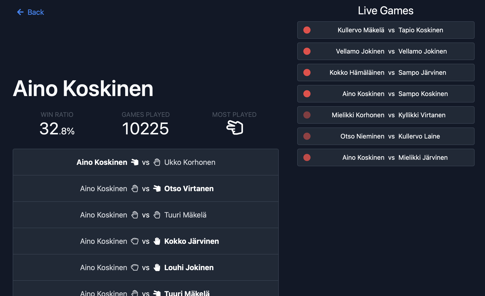

# Rockie

A rock-paper-scissors statistics app. My submission for the Summer 2022 Developer pre-assignment at Reaktor.

A live demo is running at http://ems-rockie.herokuapp.com. With a helper service running at https://ems-rockie-watcher.herokuapp.com.

## Structure

This is a [Next.js](https://nextjs.org) app, with files relating to Reaktor's Bad-Api under [./bad-api-service](./bad-api-service).

### Live events

A major part of the assignment was displaying live RPS games as they happen, but we couldn't query the Bad-Api for a list of in-progress games. I solved this problem by creating a helper service that simply stays on, perpetually listening to the Bad-Api's live channel, keeping track of which games are on-going at any given moment. That data is then fed to a client opening Rockie, so that they'll see a list of the games that started before they opened the app. The helper service code is in an orphan branch of this repo at https://github.com/emsknock/rockie/tree/bad-api-watcher.

### Data analysis

The Bad-Api's history endpoint hosts countless pages filled with individual match results for the Kalevalian-named RPS players who, I assume, are cursed to play endless matches of the ancient game of gestures, with their only hope of peace being an electrical outage. Since we needed to display statistics and player match history, the only sensible solution I know of for querying such a dataset (close to 900k individual matches at the time of writing) was to download it into a database engine. I opted for Postgres, since I've used it before and I was in a hurry to finish this assignment in time.

The Bad-Api does give each RPS match its own `gameId`, but the id seems to be a variable length hexadecimal string. Given the (ever increasing) number of matches, storing long unique strings like that was out of the question. I opted to use the [xxHash](https://cyan4973.github.io/xxHash/) hash algorithm to turn each string into a 32-bit integer, which just so happens to fit Postgres's `integer` datatype.

## Self-critique

Due to life getting in the way, I didn't have as much time as I would've liked to dedicate to this project. I really value good-looking and slick-feeling products and apps but decided to spend my time more on the back-end functionality and reliability than on UI. That's both because it was clearly the core idea of the assignment and because I'm less familiar with tweaking databases and whatnot compared to making divs and spans colourful and bouncy.

I'm sure some of my database queries are _less-than optimal_, and I'll probably return to this project in the future to compare some alternative approaches to indexing and querying.

In general, I should've picked my battles more wisely. I wasted a lot of time trying to stubbornly solve issues when I should've just approached something from a different angle. I know I can focus too much on doing things "the correct" or "the most sustainable" way — something that of course stems from trying not to shoot myself in the foot later down the line but sometimes it's just best to specify a return type by hand than attempt to create a formally correct utility type to unwrap a promise. When the deadline crept nearer, I fortunately got over myself and managed to get the UI done in time, even though the code got a bit messy for my standards.
